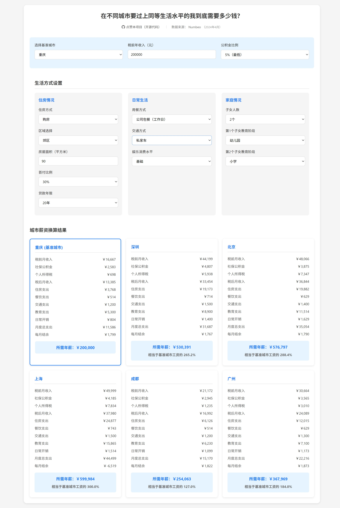

# city_compare - 在不同城市要过上同等生活水平的我到底需要多少钱？

**City Compare** 是一个简单的在线工具，帮助用户通过比较不同城市的生活成本来评估税前年收入的生活水平。项目的数据来源于 [Numbeo](https://www.numbeo.com/common/)，用户可以通过设置生活方式、居住方式、交通方式等多个参数，来计算并对比不同城市的生活成本和所需年薪。



## 项目特点
- 支持多城市的生活成本对比。
- 动态调整住房、餐饮、交通、教育等支出。
- 根据用户的输入自动计算并展示税前、税后工资，社保、公积金以及生活总支出。
- 提供可视化对比结果，帮助用户了解在不同城市中保持相同生活水平所需的年薪。

## 部署地址
项目已部署在 Vercel 上，你可以通过以下链接访问：
[City Compare](https://city-compare.vercel.app/)

## 数据来源
- 本项目的数据来源于 [Numbeo](https://www.numbeo.com/common/)，其数据包括各城市的餐饮、住房、交通等多个方面的平均成本。

## 如何使用
1. 访问项目部署地址 [https://city-compare.vercel.app/](https://city-compare.vercel.app/)。
2. 选择基准城市，输入税前年收入，并设置住房、餐饮、交通、教育等生活方式参数。
3. 查看基准城市的月度收支详情。
4. 自动生成与基准城市生活水平相当的其他城市的年薪对比。

## 项目架构
- **前端技术**: HTML, CSS, JavaScript
- **后端服务**: Vercel 部署
- **数据格式**: CSV 文件处理，数据通过 JavaScript 加载

## 本地运行
如果你希望在本地运行该项目，可以按以下步骤操作：

1. 克隆仓库：
    ```bash
    git clone https://github.com/your-repo/city_compare.git
    ```

2. 进入项目目录：
    ```bash
    cd city_compare
    ```

3. 安装依赖（如果有后端服务）：
    ```bash
    npm install
    ```

4. 启动项目：
    ```bash
    npm run dev
    ```

## 贡献指南
欢迎对项目提出建议或提交 Pull Request。如果有任何问题，请联系项目维护者。